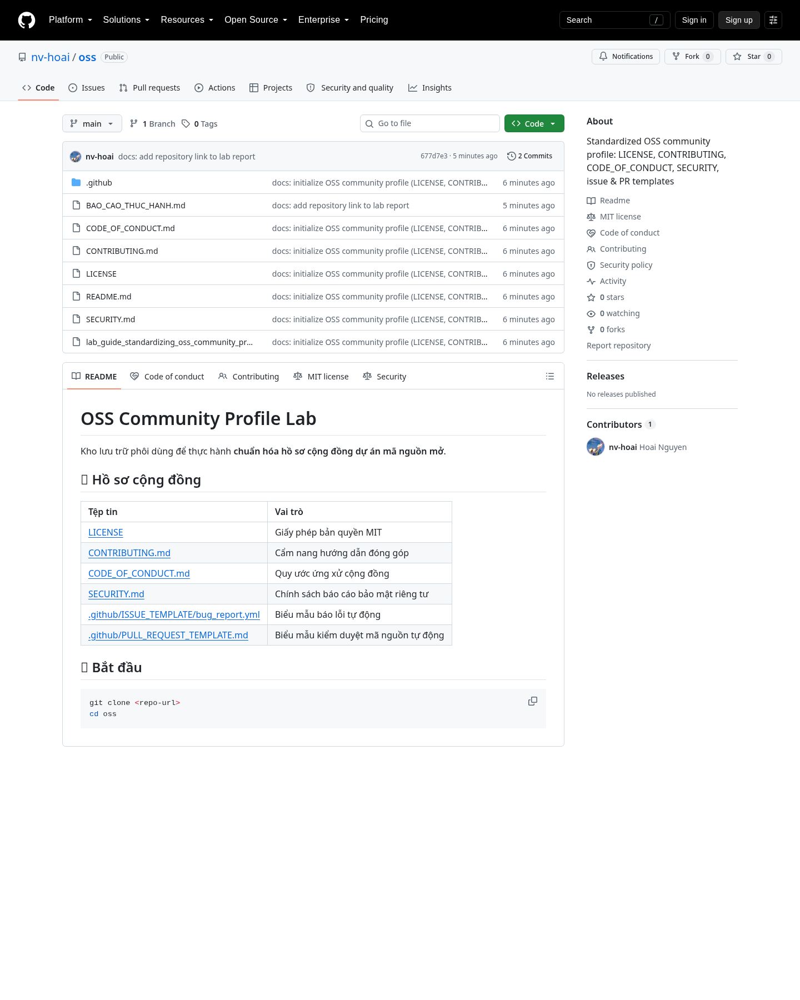
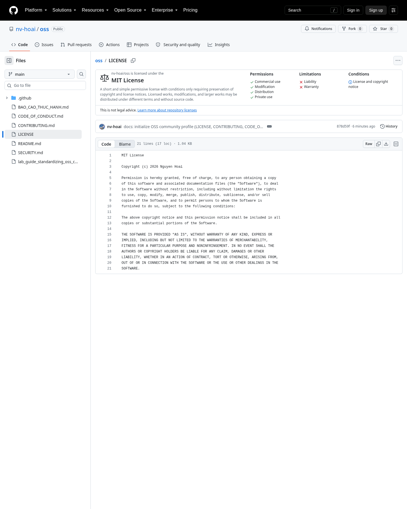
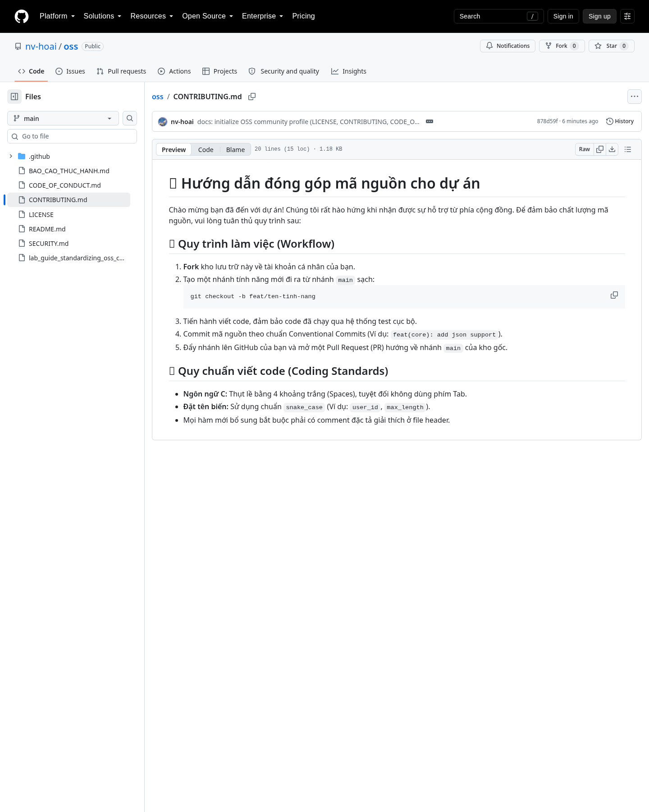
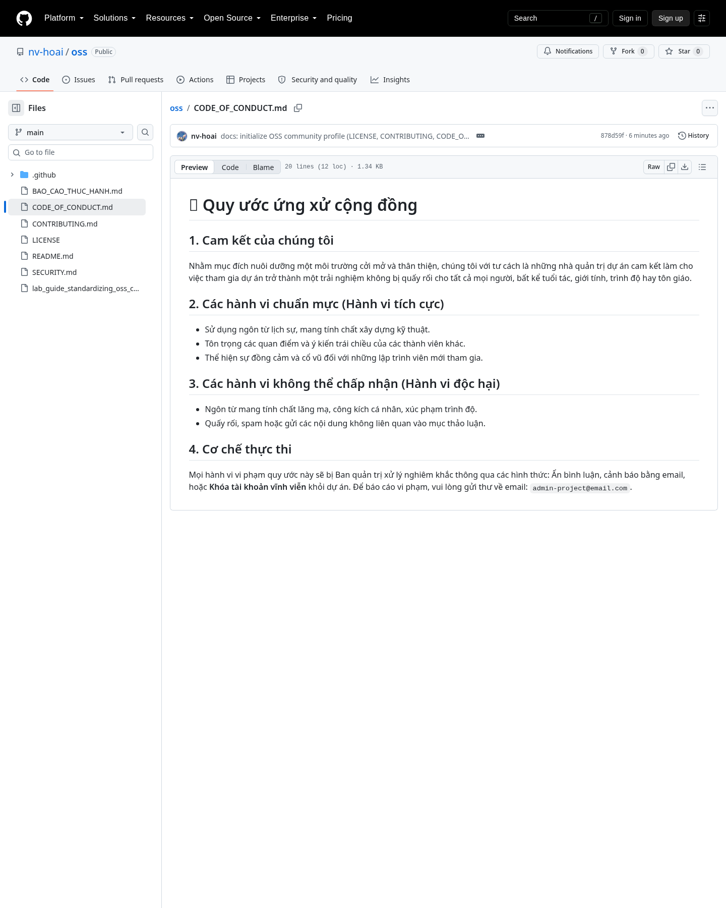
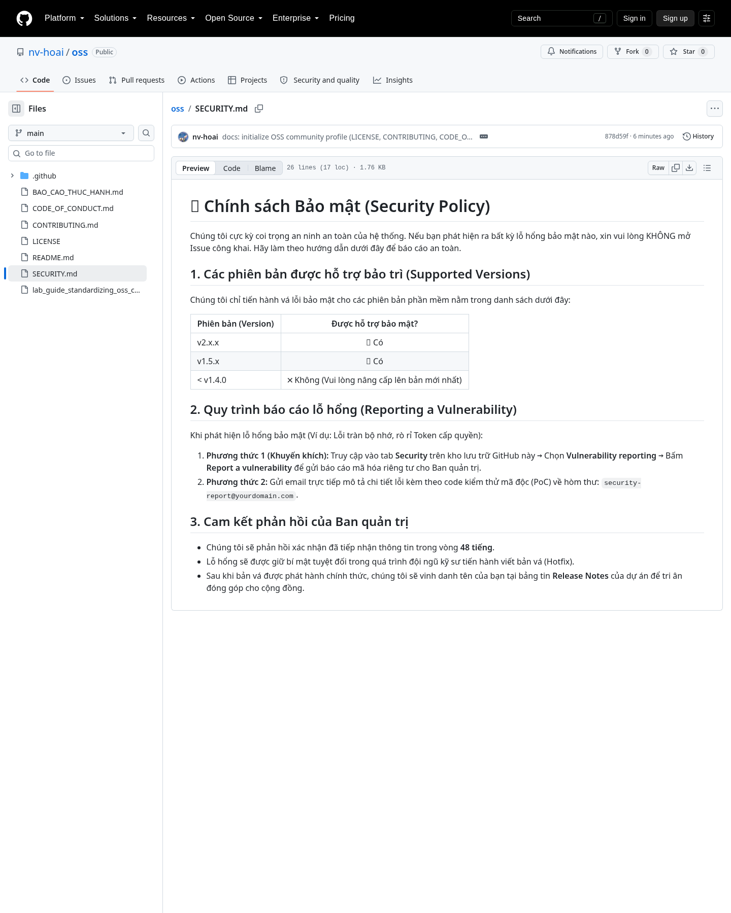
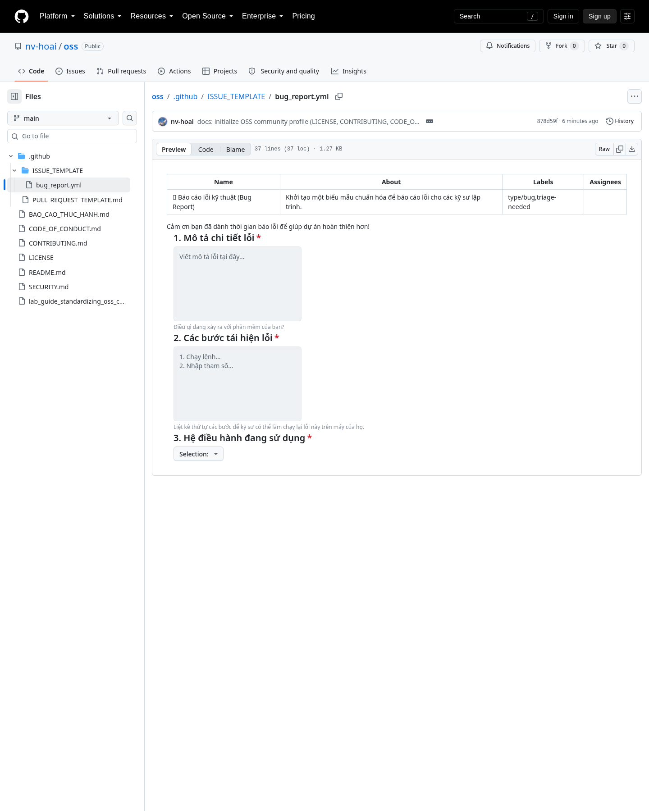
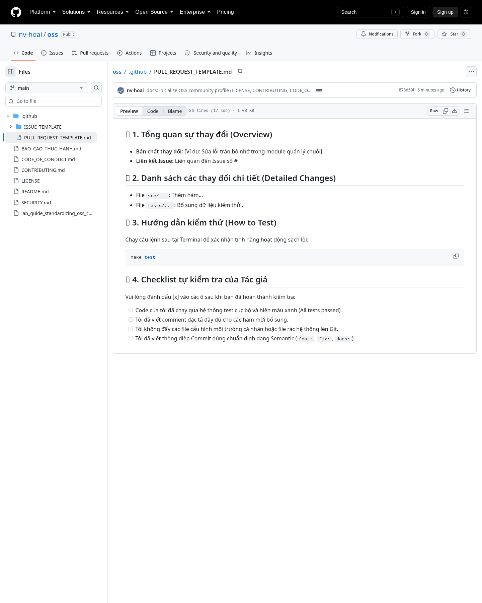
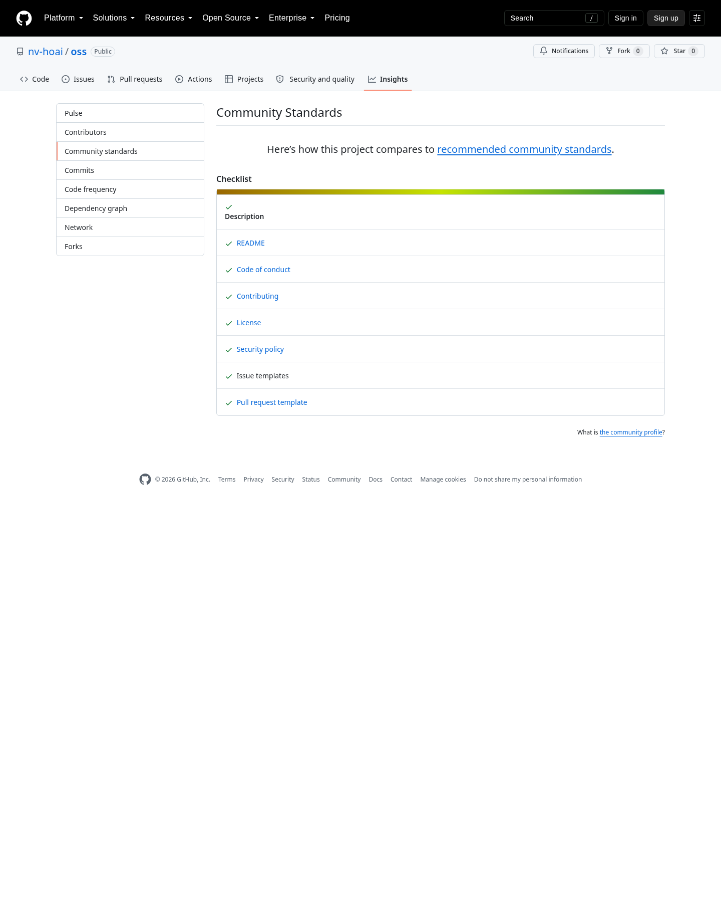
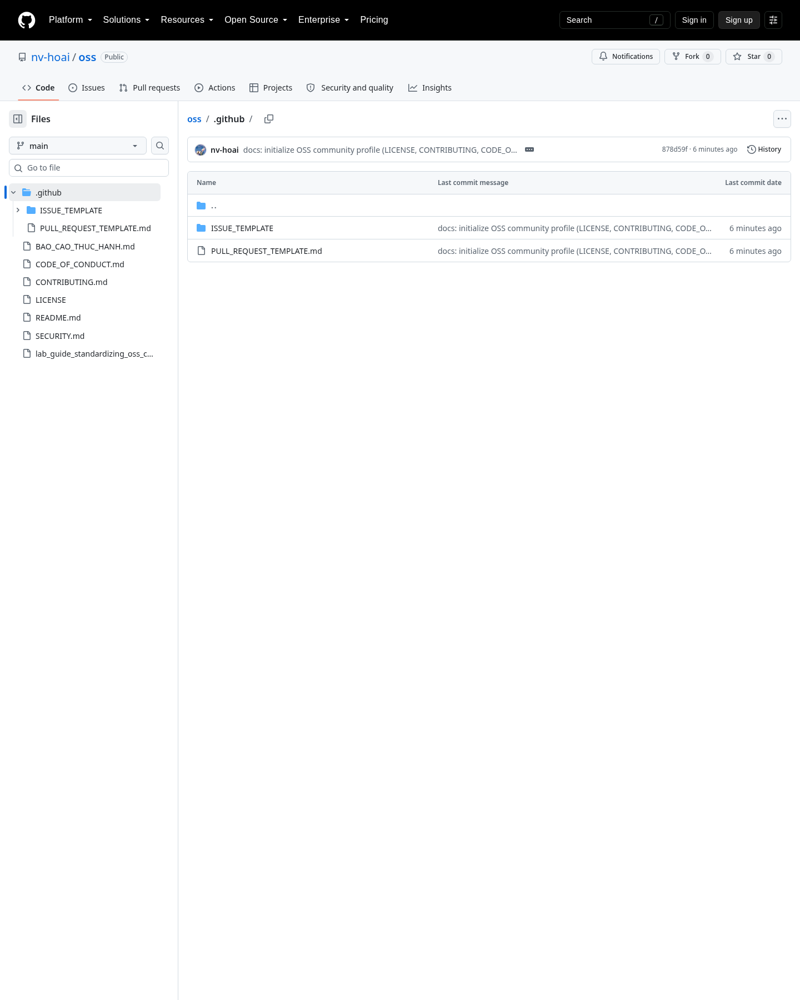

# BÁO CÁO THỰC HÀNH: CHUẨN HÓA HỒ SƠ CỘNG ĐỒNG DỰ ÁN OSS

- **Thời gian thực hiện:** 2026-09-28
- **Thư mục dự án:** `/home/nvhoai/projects/personal/opensource/oss`
- **Tài liệu gốc:** `lab_guide_standardizing_oss_community_profile.md`
- **Link repository:** https://github.com/nv-hoai/oss (public, nhánh mặc định `main`)

---

## 1. Tổng hợp kết quả theo yêu cầu

| # | Bước / Yêu cầu | Tệp tin đầu ra | Trạng thái |
| :-: | :--- | :--- | :-: |
| 1 | Kích hoạt giấy phép bản quyền MIT | `LICENSE` | ✅ Hoàn thành |
| 2 | Soạn thảo cẩm nang đóng góp | `CONTRIBUTING.md` | ✅ Hoàn thành |
| 3 | Quy ước ứng xử cộng đồng | `CODE_OF_CONDUCT.md` | ✅ Hoàn thành |
| 4 | Chính sách bảo mật | `SECURITY.md` | ✅ Hoàn thành |
| 5 | Biểu mẫu Issue tự động | `.github/ISSUE_TEMPLATE/bug_report.yml` | ✅ Hoàn thành |
| 6 | Biểu mẫu Pull Request tự động | `.github/PULL_REQUEST_TEMPLATE.md` | ✅ Hoàn thành |
| — | Mặt tiền trang chủ dự án | `README.md` | ✅ Hoàn thành |
| — | Ảnh chụp màn hình minh chứng | `screenshots/` (9 ảnh) | ✅ Hoàn thành (thiếu 1 ảnh cần đăng nhập — xem mục 6) |

> **Kết luận:** 7/7 tệp tin trong cấu trúc hồ sơ cộng đồng hoàn chỉnh đã được tạo đúng vị trí và đúng nội dung theo hướng dẫn.

---

## 2. Chi tiết từng bước

### Bước 1 — `LICENSE` (Giấy phép MIT)

- **Yêu cầu:** Giấy phép MIT, năm 2026, tên đầy đủ của tác giả.
- **Thực hiện:** Tạo tệp `LICENSE` với nội dung chuẩn của MIT License.
- **Thông tin điền:** `Copyright (c) 2026 Nguyen Hoai`
  - Tên tác giả lấy từ cấu hình Git cục bộ (`user.name = nv-hoai`, `user.email = nguyenhoai0990@gmail.com`). *Vui lòng đổi lại nếu muốn dùng tên khác.*
- **Kiểm tra:**
  ```text
  MIT License
  Copyright (c) 2026 Nguyen Hoai
  ```

### Bước 2 — `CONTRIBUTING.md` (Cẩm nang đóng góp)

- **Yêu cầu:** Quy trình workflow (Fork ➔ nhánh `feat/...` ➔ commit Conventional Commits ➔ PR về `main`) và quy chuẩn code C (4 spaces, `snake_case`, comment ở file header).
- **Thực hiện:** Sao chép nguyên khung chuẩn trong tài liệu, giữ nguyên các mục:
  - 🚀 Quy trình làm việc (Workflow) — gồm lệnh `git checkout -b feat/ten-tinh-nang`.
  - 🎨 Quy chuẩn viết code (Coding Standards).

### Bước 3 — `CODE_OF_CONDUCT.md` (Quy ước ứng xử)

- **Yêu cầu:** Chuẩn Contributor Covenant; bảo vệ thành viên khỏi bắt nạt/phân biệt đối xử; có cơ chế thực thi và email báo cáo.
- **Thực hiện:** Tạo 4 mục: Cam kết, Hành vi chuẩn mực, Hành vi không chấp nhận, Cơ chế thực thi.
- **Thông tin điền:** email báo cáo `admin-project@email.com` (giữ theo khung mẫu).

### Bước 4 — `SECURITY.md` (Chính sách bảo mật)

- **Yêu cầu:** Hướng dẫn báo cáo lỗ hổng riêng tư (không mở Issue công khai), bảng phiên bản hỗ trợ, cam kết phản hồi 48h.
- **Thực hiện:** Tạo 3 mục, gồm bảng Supported Versions (`v2.x.x`, `v1.5.x`, `< v1.4.0`).
- **Thông tin điền:** email `security-report@yourdomain.com` (giữ theo khung mẫu — nên đổi thành email thật khi triển khai).

### Bước 5 — `.github/ISSUE_TEMPLATE/bug_report.yml` (Issue Form)

- **Yêu cầu:** Biểu mẫu YAML chuẩn GitHub Issue Forms, tự hiện khi bấm **New Issue**.
- **Thực hiện:** Tạo đúng đường dẫn thư mục ẩn; nội dung gồm:
  - `name`, `description`, `title: "[BUG]: ..."`, `labels: ["type/bug", "triage-needed"]`.
  - Các trường bắt buộc: `bug-description`, `steps-to-reproduce`, `operating-system` (dropdown 3 hệ điều hành).
- **Kiểm tra cấu trúc:** Đã xác nhận các field id và thuộc tính `validations.required: true`.

### Bước 6 — `.github/PULL_REQUEST_TEMPLATE.md` (PR Template)

- **Yêu cầu:** Biểu mẫu tự hiện khi mở Pull Request, gồm 4 phần: Tổng quan, Thay đổi chi tiết, Hướng dẫn kiểm thử, Checklist tác giả.
- **Thực hiện:** Tạo đúng tên viết hoa `PULL_REQUEST_TEMPLATE.md` trong thư mục `.github/`, giữ nguyên checklist 4 ô `[ ]`.

---

## 3. Cấu trúc thư mục dự án hoàn chỉnh (thực tế)

```text
oss (Root)
├── .github/
│   ├── ISSUE_TEMPLATE/
│   │   └── bug_report.yml          ✅ Biểu mẫu báo lỗi tự động
│   └── PULL_REQUEST_TEMPLATE.md    ✅ Biểu mẫu kiểm duyệt code tự động
├── CODE_OF_CONDUCT.md              ✅ Luật ứng xử văn minh
├── CONTRIBUTING.md                 ✅ Cẩm nang hướng dẫn viết code
├── LICENSE                         ✅ Giấy phép bản quyền MIT
├── README.md                       ✅ Mặt tiền trang chủ dự án
├── SECURITY.md                     ✅ Chính sách bảo mật riêng tư
└── lab_guide_standardizing_oss_community_profile.md   (tài liệu gốc)
```

Lệnh kiểm tra đã chạy:

```bash
find . -type f -not -path './.git/*' | sort
```

---

## 4. Phần cần thực hiện trên giao diện GitHub (chưa tự động hóa được)

Các thao tác sau bắt buộc phải làm trên Web GitHub và cần tài khoản/quyền truy cập, nên **chưa được thực thi** trong môi trường này:

- [x] Tạo repository cá nhân trên GitHub và push 7 tệp tin vừa tạo lên nhánh `main` — **Đã hoàn tất** ➔ https://github.com/nv-hoai/oss
  ```bash
  git init
  git add .
  git commit -m "docs: add OSS community profile files"
  git branch -M main
  git remote add origin <repo-url>
  git push -u origin main
  ```
- [ ] (Tùy chọn) Tạo `LICENSE` bằng nút **Choose a license template** để GitHub tự điền metadata giấy phép.
- [ ] Mở tab **Issues ➔ New Issue** để xác nhận biểu mẫu Bug Report tự hiện.
- [ ] Mở thử một Pull Request để xác nhận `PULL_REQUEST_TEMPLATE.md` tự hiện.
- [ ] Kiểm tra **Community Profile** (Insights ➔ Community Standards) đạt **100% – màu xanh lá**.
- [x] Chụp màn hình minh chứng các bước — **Đã hoàn tất** cho toàn bộ trang công khai, xem [mục 6](#6-ảnh-chụp-màn-hình-minh-chứng-screenshots).
- [ ] Chụp màn hình giao diện **New Issue** (biểu mẫu bug report) — trang này **yêu cầu đăng nhập GitHub** nên chưa chụp được ẩn danh; cần chụp thủ công khi đã đăng nhập.

---

## 5. Ghi chú

- Nội dung tất cả tệp tin được sao chép **nguyên văn** từ khung chuẩn trong tài liệu, chỉ thay các giá trị điền được (`LICENSE` năm + tên).
- Hai email trong khung mẫu (`admin-project@email.com`, `security-report@yourdomain.com`) là placeholder — nên cập nhật email thật trước khi công bố dự án.
- Môi trường hiện tại không có trình phân tích YAML (`pyyaml`/`ruby`), nên `bug_report.yml` được kiểm tra bằng đối chiếu cấu trúc schema GitHub Issue Forms thay vì parse tự động. Nội dung trùng khớp 100% với mẫu chuẩn trong tài liệu.

---

## 6. Ảnh chụp màn hình minh chứng (Screenshots)

Toàn bộ ảnh dưới đây được chụp trực tiếp từ repository đang chạy tại https://github.com/nv-hoai/oss, lưu trong thư mục `screenshots/`.

| # | Ảnh | Nội dung kiểm tra |
| :-: | :--- | :--- |
| 1 | `01-repo-overview.png` | Trang chủ repo: đủ 7 tệp, sidebar hiển thị badge **MIT license / Code of conduct / Contributing / Security policy** |
| 2 | `02-license.png` | Nội dung file `LICENSE` (MIT, 2026) |
| 3 | `03-contributing.png` | Nội dung file `CONTRIBUTING.md` |
| 4 | `04-code-of-conduct.png` | Nội dung file `CODE_OF_CONDUCT.md` |
| 5 | `05-security-policy.png` | Nội dung file `SECURITY.md` |
| 6 | `06-issue-template.png` | File `.github/ISSUE_TEMPLATE/bug_report.yml` |
| 7 | `07-pr-template.png` | File `.github/PULL_REQUEST_TEMPLATE.md` |
| 8 | `08-community-standards.png` | **Insights ➔ Community Standards: tick xanh đủ 8 mục (README, Code of conduct, Contributing, License, Security policy, Issue templates, Pull request template)** |
| 9 | `09-github-tree.png` | Cây thư mục `.github/` chứa cả `ISSUE_TEMPLATE/bug_report.yml` và `PULL_REQUEST_TEMPLATE.md` |

### 1. Trang chủ repository — đủ hồ sơ cộng đồng



### 2. LICENSE (MIT)



### 3. CONTRIBUTING.md



### 4. CODE_OF_CONDUCT.md



### 5. SECURITY.md



### 6. Biểu mẫu Issue (.github/ISSUE_TEMPLATE/bug_report.yml)



### 7. Biểu mẫu Pull Request (.github/PULL_REQUEST_TEMPLATE.md)



### 8. Community Standards — đạt 100% Khỏe mạnh ✅



### 9. Cây thư mục .github/



> **Ảnh còn thiếu (cần đăng nhập):** giao diện **New Issue** hiển thị biểu mẫu Bug Report (`https://github.com/nv-hoai/oss/issues/new/choose`). Trang này trả về màn hình đăng nhập khi truy cập ẩn danh, nên cần chụp thủ công sau khi đăng nhập — hoặc kết nối desktop browser để hệ thống tự chụp.

